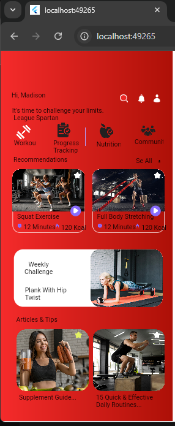
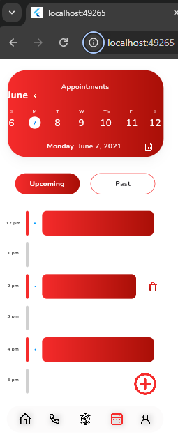
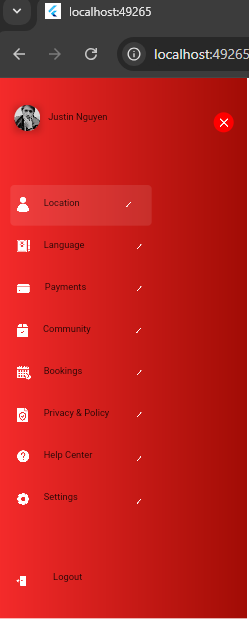
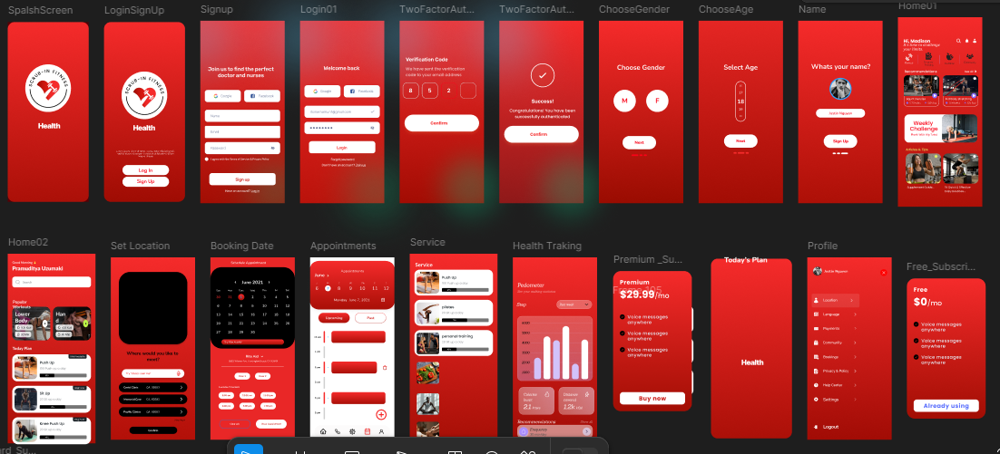

# scrubtofit

A new Flutter project.

## Getting Started

This project is a starting point for a Flutter application.

A few resources to get you started if this is your first Flutter project:

- [Lab: Write your first Flutter app](https://docs.flutter.dev/get-started/codelab)
- [Cookbook: Useful Flutter samples](https://docs.flutter.dev/cookbook)

For help getting started with Flutter development, view the
[online documentation](https://docs.flutter.dev/), which offers tutorials,
samples, guidance on mobile development, and a full API reference.

## Here are some screenshots of running application.

## Splash Screen.

## Login SignUp Page
 
  

  

## Home Screen.

## Schedule Appointments 
 
## Home Screen
 

## Name Profile Screen
 

## Logined User's Profile Screen
  

 ## Progress  Tracking Screen
  
 

## Home Screen

 
## Select Age

   

 ## Inserting Profile Information
 

## Self Explanatory Screen
    
  
    

   

    

  

 

    

  
 

## All Screen in single place.

 
